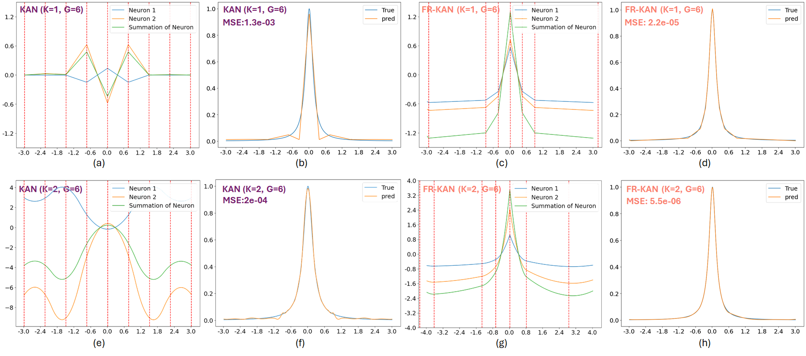
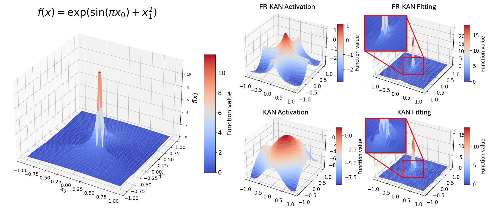
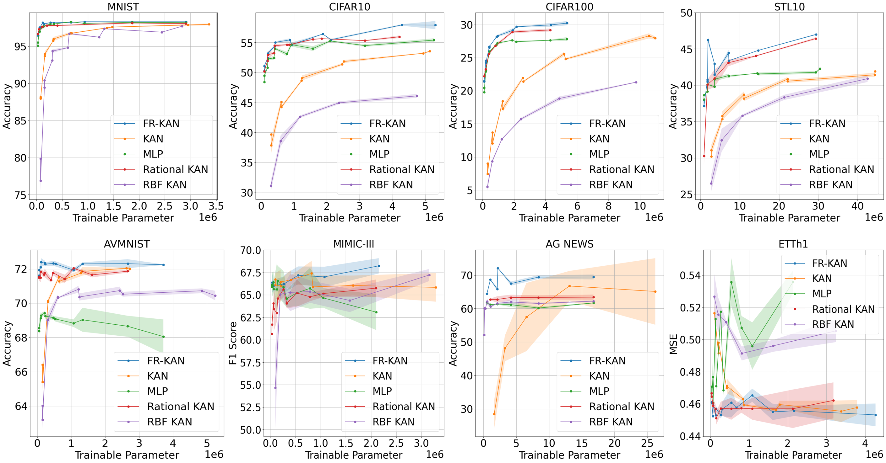

# Official Repository for Free-Knot KAN

This repository is official Pytorch implementation of Free-Knot Kolmogorov-Arnold Network (KAN).
The original implementation of KAN is available [here](https://github.com/KindXiaoming/pykan). Efficient implementation of KAN is available at [Efficient-KAN](https://github.com/Blealtan/efficient-kan). The paper is available as pre-print for now.


## Key Insight
Our method propose Free-Knot KAN to unleash fixed grid limitation of original KAN. This free grid also introduce more spline knots generate by KAN to offer more spline knots to final spline. This gives much more flexible than fixed knots.




## Environment
```bash
conda create -n FRKAN python==3.9
conda activate FRKAN
conda install pytorch==2.3.0 torchvision==0.18.0 torchaudio==2.3.0 pytorch-cuda=12.1 -c pytorch -c nvidia
```


## Retrieve Dataset
To run the model, we need to retrieve the dataset, which are all public available. For MNIST, CIFAR10, CIFAR100, STL10, AG NEWS are all available in [PyTorch](https://pytorch.org/vision/0.20/datasets.html), which can be directly downloaded in our implementation scripts. ETTh1, MIMIC-III, and AVMNIST, however, needs a little preprocessing from other works. 

### ETTh1
We thank the author of [this repository](https://github.com/DAMO-DI-ML/NeurIPS2023-One-Fits-All) that offers preprocessing script and ready-to-use data to our work. There is direct link to download ETTh1 dataset. Place it under `./data`.

### MIMIC-III
MIMIC-III is a large scale database that requires all the user to retrieve ethical liscence. We do not provide the MIMIC-III data itself. You must acquire the data yourself from [https://mimic.physionet.org/](https://mimic.physionet.org/). We thank the author of [MIMI-III Benchmark](https://github.com/YerevaNN/mimic3-benchmarks), [CnicalNotesICU](https://github.com/kaggarwal/ClinicalNotesICU), and [MultimodalMIMIC](https://github.com/XZhang97666/MultimodalMIMIC) that offers well-orgnized preprocessing scripts. Firstly, you need to retrieve raw data of MIMIC-III containing many `.csv` files to extract irregular time series modality. Secondly, run scripts offer by [ClinicalNotesICU](https://github.com/kaggarwal/ClinicalNotesICU) to extract clinical notes modality. Thirdly, run `preprocess.py` offered by [MultimodalMIMIC](https://github.com/XZhang97666/MultimodalMIMIC) to match the patients. Next, you should be able to obtain `trainp2x_daata.pkl` and `testp2x_daata.pkl`. Place them into `./data/MIMIC-III/`.

We only test our propose method on in-hospital-mortality task and consider only those patients with full modality.

### AVMNIST
Refers to [Multibench](https://github.com/pliang279/MultiBench) to download AVMNIST and place it to `./data`


## Run Experiments
We offer all the scripts of our experiments in `./scripts` and function approximation task in `./Function_Fitting.ipynb`. We fix the grid range as [-10, 10], you may make it bigger if needed, and grid size as 20 for most of experiments.


```bash
cd scripts
bash [task]/[name_of_script].sh
```





## Acknoledgement
We thank [Pykan](https://github.com/KindXiaoming/pykan) and [Efficient-KAN](https://github.com/Blealtan/efficient-kan) for the inspiring implementation and optimized code for pytorch.
